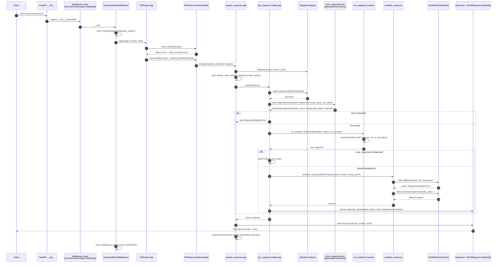

# Research: Request-Spine Flow — `routing.py` / `applications.py`

**Date**: 2026-07-21T00:00:00Z
**Researcher**: szaroket
**Git Commit**: b36aed638ea0c187ce92461e8f7cdc823bf42af5
**Branch**: master
**Repository**: fastapi

## Research Question

Analyze the request-spine flow (the *Risk Zone* `routing.py`, plus the *Day One* files
`fastapi/applications.py` and `fastapi/routing.py`) from `context/map/repo-map.md`, using three
parallel sub-agents:

1. **Trace e2e** — reconstruct the path from entry point, through layers, to write/read and back;
   a step sequence with `file:line` plus a Mermaid diagram.
2. **Test gaps** — which methods/branches on this path are covered and which are not.
3. **Blast radius** — what must change together (interface seam, generated layers, model,
   migrations, tests); static graph joined with git co-change.

Describe the current repository state only. Report must separate **evidence** from **inference**
from **unknown**, and contain two explicit sections: *Feature overview* and *Technical debt*.

> **Method constraint carried from the brief:** the repo-map's rankings are *commit-weighted*
> (commits touching a path, not lines changed or runtime importance). A line-weighted re-run could
> shift the picture. FastAPI runs `ruff` continuously, so no mass-reformat commit distorts the
> counts.

> **Structural re-verification pass (2026-07-21, ast-grep 0.44.1 + grep cross-check):** every
> structural claim below (call-site counts, import counts, "only here" / "single seam" assertions,
> field/method/test counts, vendored-symbol identity, line anchors) was machine-checked against the
> tree at `b36aed6`; each ast-grep zero was re-confirmed with a plain grep to separate a real absence
> from a bad pattern. Corrections applied inline. Notable fixes: `solve_dependencies` has **3** call
> sites (not one); `_APIRouteLike` is a **41**-field Protocol (not ~25); routing imports **8** (not 9)
> symbols from `dependencies/utils.py`; `compile_path` is **imported, not vendored** (4 real vendored
> blocks); `routing.py` is **6385** LOC; and the **Pydantic-v1 compat path was removed**, not active
> (`temp_pydantic_v1_params.py`, `_compat/v1.py`, `_compat/main.py`, `tests/test_compat_params_v1.py`
> all absent from the tree). Git-history co-change counts were out of scope for this pass (not
> ast-grep-checkable) and are left as originally reported, except where they cite now-deleted files.

---

## Summary

The request spine is a **composition-time → request-time** pipeline. At import time a `FastAPI`
app (a `Starlette` subclass) delegates all routing to a single `APIRouter`; each route decorator
funnels through `add_api_route`, which builds an `APIRoute` whose `__init__` *eagerly compiles the
per-request handler closure* into `self.app`. At request time an ASGI call passes through a
middleware stack (two Starlette middlewares wrapping FastAPI's `AsyncExitStackMiddleware`), the
router's match loop, the route's `handle`, a `request_response` wrapper that opens two more exit
stacks, and finally the `get_request_handler` closure that reads the body, calls the single DI seam
`solve_dependencies`, runs the endpoint, and serializes the response through Pydantic before writing
it back out.

Three findings dominate:

1. **This is a heavily-modified FastAPI fork, not upstream.** The spine carries fork-specific
   features the repo-map does not fully reflect: **SSE / JSONL streaming** branches inside the
   handler, a structural **`_APIRouteLike` Protocol** seam to OpenAPI, a **`frontend()`** feature, a
   **recently-*removed* Pydantic-v1 compat path** (dropped in commit `e30063055` "Drop support for
   `pydantic.v1`"; only stale references remain — see Technical debt #4), and **vendored copies of
   Starlette internals** pinned to a specific upstream PR.

2. **"e2e-only" is only half true.** The *include / routing-context machinery* (`_IncludedRouter`,
   `_EffectiveRouteContext`, `RouteContext`) is the **best unit-tested** part of the file. The
   *serialization/dispatch spine* (`get_request_handler`, `serialize_response`,
   `run_endpoint_function`, `get_websocket_app`) has **no unit tests at all** — it is exercised
   exclusively through `TestClient`, confirming the repo-map's concern for that region specifically.

3. **The highest-risk coupling is silent.** OpenAPI generation reads route fields through a
   *structural* 41-field Protocol (`_APIRouteLike`); renaming/altering a route field breaks generated
   schema at **runtime**, with
   no import-graph or compile-time signal. Second-highest is the **vendored/private Starlette
   coupling**, invisible to both the import graph and git co-change.

---

## Feature overview

### What the flow is

The request spine turns a registered Python endpoint into an ASGI application and then, per request,
turns an ASGI call into a validated response. It spans two phases:

**Phase 1 — Composition (import time).** `FastAPI` extends Starlette
(`fastapi/applications.py:42`) and, in `__init__`, instantiates one `APIRouter` as `self.router`
(`applications.py:984`). All HTTP-surface methods on the app are a thin facade delegating to that
router — e.g. `FastAPI.add_api_route` (`applications.py:1165`) just forwards to
`self.router.add_api_route` (`applications.py:1195`). `APIRouter.add_api_route` (`routing.py:2827`)
merges router-level prefix/tags/dependencies/response_class (routing imports **8** symbols from
`dependencies/utils.py`, `routing.py:52-59`), constructs
`route = route_class(...)` (`routing.py:2877`), and appends it. `APIRoute.__init__`
(`routing.py:1146`) populates route state (`response_model`, compiled path, `response_field`,
`Dependant` graph, `body_field`, streaming flags) and then **eagerly compiles the handler**:
`self.app = request_response(self.get_route_handler())` (`routing.py:1208`).

**Phase 2 — Dispatch (request time).** `FastAPI.__call__` (`applications.py:1160`) sets `root_path`
and calls Starlette's `__call__`, entering the middleware stack built by `build_middleware_stack`
(`applications.py:1020-1068`): `ServerErrorMiddleware` → user middleware → `ExceptionMiddleware`
(all Starlette) → **`AsyncExitStackMiddleware`** (FastAPI, `applications.py:1061`). That middleware
opens `scope["fastapi_middleware_astack"]` (`fastapi/middleware/asyncexitstack.py:15-18`, used to
auto-close uploaded files) and calls the router. `APIRouter.app` (`routing.py:2657`) runs the
match loop; on `Match.FULL` it calls `route.handle` (`routing.py:2668-2673`), which (for directly
registered routes) falls through to Starlette's `Route.handle` and invokes the pre-compiled
`self.app`. `request_response` (`routing.py:113`) builds the `Request`, opens two more exit stacks
(`fastapi_inner_astack` for yield-dependencies, `fastapi_function_astack`), awaits the handler, and
writes the response.

Inside `get_request_handler`'s `app(request)` closure (`routing.py:367-745`): read the body
(`:418-465`, form/json with content-type handling and error mapping) → call the **DI seam**
`solve_dependencies` (`routing.py:473` — the HTTP-spine call site; `solve_dependencies` is also
invoked at `:767` for websockets and `:2178` via `_solve_dependencies` on the included/effective-route
path, so it is the single seam *for this branch*, not the file) → on validation errors raise `RequestValidationError`
(`:735-739`) → else pick a branch: **SSE stream** (`:512-635`), **JSONL stream** (`:636-668`), raw
generator with explicit response class (`:669-688`), or the **normal path**: `run_endpoint_function`
(`:690`, def `:336` — `await dependant.call` vs `run_in_threadpool`), then either use a returned
`Response` directly (`:695-698`) or `serialize_response` (`:711`, def `:293`) which runs Pydantic
`field.validate` / `field.serialize` (response_model validation + include/exclude filtering) or
falls back to `jsonable_encoder`. The response object is built (`:724-734`), returned (`:742-743`),
and written by `await response(scope, receive, send)` (`:137`); exit stacks then unwind (yield-dep
teardown, upload-file close).

### End-to-end step sequence (evidence)

Directly verified anchors (all read from source at commit `b36aed6`):

- `fastapi/applications.py:42` — `class FastAPI(Starlette)`
- `fastapi/applications.py:984` — app instantiates `APIRouter`
- `fastapi/applications.py:1020-1068` — `build_middleware_stack` (Exception + `AsyncExitStackMiddleware`)
- `fastapi/applications.py:1160-1163` — `FastAPI.__call__` → `super().__call__`
- `fastapi/applications.py:1165-1195` — `add_api_route` → `self.router.add_api_route`
- `fastapi/middleware/asyncexitstack.py:15-18` — opens `scope["fastapi_middleware_astack"]`
- `fastapi/routing.py:113-152` — `request_response` (per-request exit stacks + response await)
- `fastapi/routing.py:293-333` — `serialize_response` (Pydantic validate/serialize / `jsonable_encoder`)
- `fastapi/routing.py:336-346` — `run_endpoint_function` (coroutine vs threadpool)
- `fastapi/routing.py:349-364` — `_build_response_args` (status precedence + background tasks)
- `fastapi/routing.py:367-745` — `get_request_handler` closure
  - `:418-465` body read/parse; `:443-457` JSONDecodeError→`RequestValidationError`; `:461-465` generic 400
  - `:473` `solve_dependencies` seam
  - `:512-688` SSE / JSONL / raw-stream branches
  - `:690` `run_endpoint_function`; `:695-698` endpoint-returned-Response branch
  - `:711` `serialize_response`; `:724-734` response construction; `:735-739` `RequestValidationError`
- `fastapi/routing.py:1146-1208` — `APIRoute.__init__` → `self.app = request_response(self.get_route_handler())`
- `fastapi/routing.py:1210-1234` — `APIRoute.get_route_handler`
- `fastapi/routing.py:1236-1266` — `APIRoute.matches` / `handle`
- `fastapi/routing.py:2657-2719` — `APIRouter.app` (match loop, 405, redirect-slash, default)
- `fastapi/routing.py:2827-2909` — `APIRouter.add_api_route`

**Inference (call site verified, body external):** Starlette internals — `Starlette.__call__`,
`ServerErrorMiddleware`/`ExceptionMiddleware`, `Route.handle`/`Route.matches`,
`Request.body/form/json`, `Response.__call__`, `wrap_app_handling_exceptions`, `run_in_threadpool`,
`compile_path` — are imported (`routing.py:83-107`) but live in the external package. Pydantic
`ModelField.validate/serialize` reaches the actual Pydantic core through `fastapi._compat`.
`solve_dependencies` internals (`dependencies/utils.py`) were traced only to the seam.

**Unknown:** exact Starlette version and its internal line numbers; the full set of alternate
dispatch branches for `include_router`-mounted / frontend / low-priority routes
(`routing.py:1246-1266`, `2699-2717`) — the primary directly-registered `APIRoute` spine is fully
traced, the included-router variants only partially.

### Flow diagram

### Test coverage of the flow

**Method note:** static reading only — no coverage tool or test suite was run, so classifications
reflect *test presence and shape*, not line-hit data. Tutorial-mirror tests (`tests/test_tutorial/**`)
are treated as THIN per the brief.

**Evidence — the "e2e-only" claim is split:**

- **Genuine unit tests exist** for the include/routing-context machinery.
  `tests/test_router_include_context.py` has **38** `def test_*` functions calling `iter_route_contexts()`,
  `_IncludedRouter._match()`, `.matches()`, `.url_path_for()`, `.effective_candidates()`, and
  constructing `RouteContext`/`_EffectiveRouteContext` by hand (e.g.
  `test_effective_api_route_context_does_not_match_websocket_scope:792`,
  `test_apirouter_matches_fallback_without_include_context:968`). `tests/test_route_scope.py`
  inspects `request.scope["route"]` directly.
- **No unit tests** for the four core handler functions: `get_request_handler`,
  `serialize_response`, `run_endpoint_function`, `get_websocket_app` are never imported/called
  directly — exercised **e2e via `TestClient` only**.

**Covered (e2e) happy + main-error paths:** response-model validate both `is_coroutine` branches
(`tests/test_serialize_response.py:15,36`), `ResponseValidationError`
(`tests/test_validate_response.py:51-82`), `dump_json` fast-path both sides
(`tests/test_dump_json_fast_path.py:30,42`), sync/async endpoint split, empty-body status codes
(`tests/test_response_code_no_body.py:41`), strict content-type
(`tests/test_strict_content_type_app_level.py`), SSE (`tests/test_sse.py`, 19 tests), JSONL
streaming (`tests/test_stream_*`), request-validation 422
(`tests/test_validation_error_context.py`), websocket validation
(`test_validation_error_context.py:113,140`), redirect-slashes both ways
(`tests/test_router_redirect_slashes.py`), router events (`tests/test_router_events.py`),
frontend (`tests/test_frontend.py`, 66 tests), callbacks (`tests/test_sub_callbacks.py`), and the
full include/context machinery (unit).

**Uncovered / thin branches (technical-debt inputs):**

| Branch | Location | Status |
|---|---|---|
| `request_response` "Response not awaited" `FastAPIError` guard | `routing.py:140-147` | **UNCOVERED** — string appears only in source + docs |
| Generic body-parse `HTTPException(400, "There was an error parsing the body")` | `routing.py:461-465` | **UNCOVERED** |
| `except HTTPException: raise` during body read | `routing.py:458-460` | **UNCOVERED** at body layer |
| `JSONDecodeError` → `json_invalid` `RequestValidationError` | `routing.py:443-457` | **THIN** — only tutorial mirror `test_tutorial/test_body/test_tutorial001.py:149` |
| Core handler spine (`get_request_handler`/`serialize_response`/`run_endpoint_function`/`get_websocket_app`) | — | **e2e-only**, no unit tests → coarse failure localization |

**Unknown:** exact line/branch hit counts — no coverage tooling was run; all judgments derive from
test presence.

---

## Technical debt

Ordered by risk (silent + fragile first).

### 1. Silent structural coupling to OpenAPI via `_APIRouteLike` Protocol — HIGH

- **Evidence:** OpenAPI generation consumes a *structural* Protocol `_APIRouteLike`
  (`routing.py:902-945`) at exactly 7 sites — `openapi/utils.py:216,230,237,262,332,483,485`
  (all 7 verified via ast-grep to reference `routing._APIRouteLike`). The Protocol declares a
  **41-field** contract surface (`path`, `endpoint`, `methods`, `response_model`, `dependant`,
  `body_field`, `response_field`, `status_code`, `callbacks`, `is_json_stream`, `is_sse_stream`,
  `stream_item_field`, `stream_item_type`, `responses`, `response_fields`, `operation_id`,
  `deprecated`, `path_regex`, `path_format`, `param_convertors`, the six `response_model_*` flags,
  `_flat_dependant`, `_embed_body_fields`, … — full list `routing.py:903-944`).
- **Inference:** because the seam is structural (Protocol), renaming or re-typing a route field
  breaks generated schema at **runtime**, with **no** import-graph edge and **no** compile-time
  error. Co-change confirms the pressure: `openapi/utils.py` co-changed with `routing.py` **13** times
  in 12 months (tied #1), `openapi/models.py` **7** times.
- **Debt:** the highest-blast, lowest-visibility edge on the spine. Any route-field change must
  edit `routing.py` + `_APIRouteLike` + `openapi/utils.py` together.

### 2. Vendored / private Starlette internals — HIGH, invisible to tooling

- **Evidence:** `routing.py:83-108` imports private symbols
  `starlette._exception_handler.wrap_app_handling_exceptions`,
  `starlette._utils.get_route_path/is_async_callable`; constructs `starlette.routing.Route/WebSocketRoute/Host`
  directly and reaches into `.path_regex`, `.path_format`, `.param_convertors`
  (`routing.py:1640-1697`). **Four** Starlette internals are **vendored** (copied local defs) —
  `request_response` (`:113`), `websocket_session` (`:157`), `_AsyncLiftContextManager` (`:185`),
  `_wrap_gen_lifespan_context` (`:208`) — each carrying a "Copy of / Vendored from starlette.routing"
  comment. (`compile_path` is **imported** from `starlette.routing`, `routing.py:101`, and *used* at
  `:799,1024,1680` — it is **not** vendored; the earlier draft mislabelled it.)
- **Inference:** a Starlette upgrade can silently break these vendored copies and private imports.
  This coupling is **under-counted by both** the import graph (external, uninstalled at graph time)
  **and** git co-change (Starlette isn't in this repo). Matches repo-map Risk Zone: "couples to
  *private* Starlette internals."
- **Unknown:** which exact Starlette version the vendored copies track; drift is undetectable from
  this repo alone.

### 3. `routing.py` size + single-owner + eager-compile complexity — MEDIUM/HIGH

- **Evidence:** **6385** LOC (`wc -l fastapi/routing.py`); repo-map records 83% single-owner and #2 co-change centrality. Handler is
  eagerly compiled in `__init__` (`routing.py:1208`), mixing four dispatch modes (normal, SSE, JSONL,
  raw-stream) plus an alternate included-router/frontend path in one file.
- **Inference:** high cognitive load; the four-way branch in `get_request_handler` is where most
  behavior and most untested defensive branches live (see Technical-debt #5).

### 4. Residual references to a *removed* Pydantic-v1 compat path — LOW (was mis-scoped as active migration)

- **Correction (structural re-verification):** the earlier draft framed this as an *active*
  Pydantic-v1-in-v2 migration entangled with the spine. That is **outdated**. Pydantic-v1 support was
  **dropped** (git log on the path: `e30063055` "➖ Drop support for `pydantic.v1`",
  `e2cd8a420` "keeping short temporary support for Pydantic v2's `pydantic.v1`"). Present-state facts:
  - `fastapi/temp_pydantic_v1_params.py` **does not exist** in the tree. Its only surviving reference
    is a **stale import** in `docs_src/pydantic_v1_in_v2/tutorial004_an_py310.py:4`
    (`from fastapi.temp_pydantic_v1_params import Body`) — which would fail at import.
  - `_compat/` contains **only** `__init__.py`, `shared.py`, `v2.py`. There is **no** `_compat/v1.py`
    and **no** `_compat/main.py`; `routing.py`/`openapi/` contain no `_compat.v1`/`_compat.main`
    references (grep exit 1).
  - `tests/test_compat_params_v1.py` and `tests/test_pydantic_v1_v2_*` **do not exist**.
- **Debt:** not an in-flight migration but a *cleanup remnant* — one dangling `docs_src` import to a
  deleted module. The remaining live compat surface is `_compat/{__init__,shared,v2}.py` (v2-only).

### 5. Untested defensive error branches on the request path — MEDIUM

- **Evidence:** `routing.py:140-147` (Response-not-awaited `FastAPIError`), `:461-465` (generic body
  400), `:458-460` (HTTPException during body read) have **no** tests; `:443-457` (JSONDecodeError)
  is tutorial-only.
- **Inference:** these are precisely the low-frequency error paths where a refactor of the eagerly
  compiled handler could regress without a failing test — and the spine has **no unit tests** to
  localize such a regression, only e2e via `TestClient`.

### 6. Repo-map reconciliation note (documentation debt) — LOW

- **Evidence:** repo-map §3 attributes the load-bearing `TYPE_CHECKING` back-edge to routing at
  "`utils.py:22`". The blast-radius scan confirms the only such back-edge is indeed
  `fastapi/utils.py:22-23` (`from .routing import APIRoute` under `if TYPE_CHECKING`), and found
  **no** back-edge from `dependencies/utils.py` to routing — coupling there runs *forward*
  (routing imports 9 symbols from `dependencies/utils.py`, `routing.py:51-60`).
- **Inference:** the map's phrasing ("`dependencies.utils → utils → routing`") is easy to misread as
  `dependencies/utils.py` importing routing. It does not; `fastapi/utils.py` does. Minor doc-clarity
  debt, not a code defect.

### Migrations

**Absent (evidence).** `find` for `*migrat*.py` / `alembic*` returned nothing — FastAPI is a
framework; no DB migrations are in the blast radius.

---

## Blast radius — ordered "change-together" set

Ranked by combined static + 12-month co-change evidence (37 commits touched `routing.py`; per-commit
`git show` tally):

| Rank | Target | Static edge | Co-change | Why it moves |
|---|---|---|---|---|
| T1 | `fastapi/dependencies/utils.py` | routing imports **8** symbols (`routing.py:52-59`) | 13 | param/dependency solving spine |
| T1 | `fastapi/openapi/utils.py` | consumes `_APIRouteLike` + ~25 fields | 13 | generated OpenAPI layer (silent-break) |
| T1 | `_APIRouteLike` Protocol (`routing.py:902-945`) | internal contract binding routing↔openapi | — | edit route fields = edit here too |
| T1 | `fastapi/applications.py` | facade delegating whole HTTP surface | 9 | app-level entry seam |
| T2 | `params.py` (8), `param_functions.py` (6), `_compat/v2.py` (11), `_compat/{__init__,shared}.py` (v2-only cluster; **no** `v1.py`/`main.py` in tree), `datastructures.py` (7), `encoders.py` (9), `openapi/models.py` (7) | param/model layer imports | high | field/model-semantics changes |
| T2 | `exceptions.py` (7), `utils.py` (8, TYPE_CHECKING back-edge `utils.py:22`) | error types / type-only edge | med | error + type contracts |
| T3 | `security/http.py`, `security/api_key.py` (4 each) | **no direct routing import** | med | coupled only via param/dependency layer |
| test | `test_router_*`, `test_frontend.py`, `test_response_model_as_return_annotation.py` (note: `test_compat_params_v1.py` cited in an earlier draft **no longer exists**) | — | high | healthy change-with-test discipline |

**Discount as noise (`[regen]`/`[git]`):** `tests/test_tutorial/**` (tutorial mirroring), `docs/**`
+ `mkdocs.yml` (docs regen), `pyproject.toml`/`uv.lock` (dep bumps).

## Code References

- `fastapi/applications.py:42,984,1020-1068,1160-1163,1165-1195` — app composition + entry + facade
- `fastapi/middleware/asyncexitstack.py:15-18` — `fastapi_middleware_astack`
- `fastapi/routing.py:113-152` — `request_response`
- `fastapi/routing.py:293-333` — `serialize_response`
- `fastapi/routing.py:336-346` — `run_endpoint_function`
- `fastapi/routing.py:367-745` — `get_request_handler` (body `:418-465`, DI seam `:473`, streams `:512-688`, serialize `:711`, build `:724-734`, errors `:735-739`)
- `fastapi/routing.py:902-945` — `_APIRouteLike` Protocol (OpenAPI seam)
- `fastapi/routing.py:1146-1208` — `APIRoute.__init__` (eager `self.app = request_response(...)`)
- `fastapi/routing.py:1210-1266` — `get_route_handler` / `matches` / `handle`
- `fastapi/routing.py:2657-2719,2827-2909` — `APIRouter.app` / `add_api_route`
- `fastapi/routing.py:83-108,1640-1697` — Starlette private/vendored coupling
- `fastapi/openapi/utils.py:216-485` — OpenAPI reads route fields
- `fastapi/utils.py:22-23` — TYPE_CHECKING back-edge to routing
- `tests/test_router_include_context.py` — unit tests for include/context machinery
- `tests/test_serialize_response.py`, `test_dump_json_fast_path.py`, `test_sse.py`, `test_stream_*`, `test_validation_error_context.py`, `test_router_redirect_slashes.py`, `test_frontend.py` — e2e coverage of spine branches

## Architecture Insights

- **Eager handler compilation** at route construction (`routing.py:1208`) is the key design move:
  per-request cost is amortized to import time, but it means route-field state and the handler closure
  are captured once — a subtle coupling for anyone changing route fields after construction.
- **Four exit-stack layers** cooperate: `fastapi_middleware_astack` (upload files),
  `fastapi_inner_astack` (yield-dependency teardown), `fastapi_function_astack`, plus DI's own stack.
  This is the mock surface the repo-map flags for the DI resolver.
- **One DI seam per dispatch branch.** `solve_dependencies` is the sole parameter/validation entry
  point, but the file has **three** call sites — `routing.py:473` (HTTP spine), `:767` (websocket app),
  `:2178` (`_solve_dependencies`, included/effective-route path). Each dispatch branch funnels through
  the same function; routing stays agnostic to how params resolve.
- **Structural (Protocol) coupling to OpenAPI** is deliberate decoupling that trades a compile-time
  contract for runtime flexibility — powerful, but the source of the #1 silent-break risk.
- **Fork divergence** (SSE/JSONL, `frontend()`, vendored Starlette, `temp_pydantic_v1_params`) means
  upstream FastAPI docs/issues are an imperfect guide for this tree.

## Historical Context (from prior changes)

- `context/map/repo-map.md` — the source brief: `routing.py` as Risk Zone (6385 LOC, 83% one owner,
  private-Starlette coupling, e2e-only); `applications.py`/`routing.py` as Day One reading; the
  fragile `_compat ↔ params ↔ DI/routing` knot; `openapi/utils.py ↔ routing.py` as tightest `[git]`
  pair with no import cycle. This research confirms all four and adds the `_APIRouteLike` structural
  seam and the fork-specific streaming/frontend/Pydantic-v1 surface the map underweights.
- No `context/foundation/lessons.md` present at research time — no prior accepted rules to reconcile.

## Related Research

- None yet under `context/changes/**/research.md` or `context/archive/**/research.md` besides this
  document. This is the first deep-dive on the request spine.

## Open Questions

1. Which exact Starlette version do the vendored copies (`request_response`, `websocket_session`,
   `compile_path`) track, and how far has upstream drifted? (Needs the installed Starlette, absent here.)
2. ~~Is `temp_pydantic_v1_params.py` on a path to removal?~~ **Resolved by re-verification:** the
   module was already **removed** (commit `e30063055`); only a dangling `docs_src` import survives
   (Technical debt #4). Follow-up: delete the stale import in
   `docs_src/pydantic_v1_in_v2/tutorial004_an_py310.py:4`.
3. Runtime branch-hit coverage for the four uncovered defensive branches — confirmable only by
   running `coverage`/the suite (not run per brief).
4. Full behavioral trace of the `include_router`/frontend/low-priority alternate dispatch path
   (`routing.py:1246-1266,2699-2717`) — only partially traced here.
