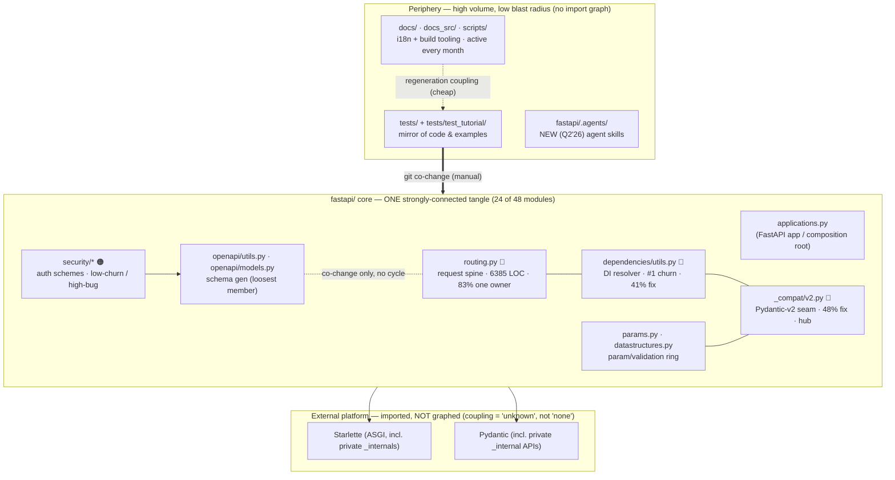

# Repo Map — FastAPI (onboarding)

> **What this is.** One picture stitched from three studies: **where the system lives**
> ([territory](artifact-1-territory.md), git history), **how it's wired**
> ([structure](artifact-2-structure.md), import graph), and **who to ask**
> ([contributors](artifact-3-contributors.md)). It does not reproduce those tables — it
> points you at the parts that matter and sends you back to the source for detail.
>
> **Window & method:** activity/ownership = **last 12 months** (2025‑07 → 2026‑07) of git
> history ranked by *commits touching a path*; structure = a **pydeps import graph of the
> `fastapi/` package only** (48 modules) plus source‑AST checks. Read the [Constraints](#7-constraints)
> section before you trust any single number.

---

## 1. TL;DR

FastAPI is a flat Python package (`fastapi/`, ~48 modules) wrapping Starlette (ASGI) and
Pydantic (validation), surrounded by a large docs/i18n/test apparatus that dwarfs it in raw
commit volume. The real engine is small and self‑referential: **the DI resolver
(`dependencies/utils.py`) and the request spine (`routing.py`)** are the gravitational
center, and **half the package is one strongly‑connected import tangle** with no safe bottom
layer. The year's work was a **Pydantic‑v2 / parameter‑annotation wave that crested in winter
(Q4'25–Q1'26)** — sweeping framework internals *and* every tutorial example at once — then
collapsed ~10× in 2026, with effort pivoting to tooling and a brand‑new `fastapi/.agents`
folder. It hurts in the **`_compat` ↔ params ↔ DI/routing knot**: high churn, high bug density
(`_compat/v2.py` 48% fix, `dependencies/utils.py` 41%), and correctness that rests on
*undocumented import‑ordering invariants*. And it is **BDFL‑concentrated** — one author
(tiangolo) owns 38–83% of every fragile file and 100% of the load‑bearing invariants.

**Where the work is focused:** DI + request lifecycle (steady backbone) and, in winter, the
Pydantic‑v2/param sweep. **Where it hurts:** the `_compat`/param/DI knot — see [Risk Zones](#4-risk-zones).

---

## 2. Terrain

**High responsibility (small, load‑bearing, dangerous):** the `fastapi/` core — especially
`routing.py`, `dependencies/utils.py`, `_compat/v2.py`, `params.py`. These carry the logic and
almost all the risk. **Periphery (high volume, low blast radius):** `tests/**`,
`docs_src/**`, `scripts/**` top the raw commit charts but are mirror/tooling churn — a test
count spikes because a fix ships its regression test, not because tests are a hotspot.

**Deep vs. shallow modules** (structure, §1):

| | Deep (much logic behind the name) | Shallow (thin, safe) |
|---|---|---|
| **Central** | `routing.py` (6385 LOC), `dependencies/utils.py` (1061 LOC, highest churn) | `exceptions.py` (fan‑in 12, rarely changes), `types.py` (fan‑in 8, ~4 commits), `openapi/models.py` |
| **Peripheral** | `_compat/v2.py` (private‑Pydantic shim, bug‑dense) | `logger.py` (1 commit ever, 2019), `security/base.py` (untouched since 2018) |

**Safe anchors to lean on:** `security/base.py`, `logger.py`, `types.py`, `exceptions.py` —
high fan‑in, near‑zero churn (territory §5). **Do not mistake for stable:** `__init__.py`
(fan‑in 21 but churn = `__version__` bumps) and `_compat/__init__.py` (fan‑in 10 but born Oct 2025).

**Activity over time** (territory §2): a winter wave (~1,600 file‑touches/quarter in Q4'25–Q1'26)
→ a pronounced 2026 calm (~10× lower). By *distinct commits* **runtime/DI leads (103)** — the
steady workhorse; by *file‑touches* **data/validation dominates (37%)** — but that's inflated by
the winter sweeps. The only domain still *rising* into 2026 is **build/tooling** (`scripts/` +
`.agents`). `scripts/` is the single most *consistent* area: active 13/13 months.

---

## 3. Real couplings — what actually changes together

**Provenance matters.** Each coupling below is tagged with how we know it, because they cost
different amounts to break:

- **`[import]`** — proven by the pydeps import graph of `fastapi/` (structure). Structural, hard.
- **`[git]`** — inferred from co‑commits only; no import edge. Could be logical or incidental.
- **`[regen]`** — changes together because one side is *generated/mirrored*, not hand‑edited.
  **Cheapest kind** — weight it far below manual coupling when costing a change.
- **`[unknown]`** — a boundary the import graph **does not cover**. Not evidence of *no* coupling.

### The fragile core (structure §"fragile core" + territory §6)

The knot where a change cannot stay local — **`_compat/v2.py` + `dependencies/utils.py` +
`routing.py` + `params.py`/`datastructures.py`**, with `_compat` as the sink hub 8 of 9 core
modules import:

| Coupling | Provenance | Note |
|---|---|---|
| `_compat/__init__.py` ↔ `_compat/v2.py` | `[import]` | **The only genuine top‑level runtime cycle.** Survives *only* by import line‑ordering in `__init__.py` — reorder it and startup dies with a partial‑init `ImportError`. |
| `_compat/v2 → params → datastructures → _compat/v2` | `[import]` | Param/validation ring; two hops are **deferred function‑local imports** deliberately breaking the load‑time cycle. |
| `routing ↔ utils`, `dependencies.utils → utils → routing` | `[import]` | Only holds because `utils.py:22` imports `routing` under `if TYPE_CHECKING`. **Type‑only back‑edge — load‑bearing.** |
| `openapi/utils.py` ↔ `routing.py` | `[git]` | Territory's tightest file pair, but **no import cycle** — pure co‑change. That makes `openapi/utils.py` the *loosest* member and the safest of the four to touch first. |
| `dependencies → _compat` (20 names) | `[import]` | The largest layer contract in the package — the concrete reason a `_compat/v2.py` change surfaces as a `dependencies/utils.py` bug. |
| `security/* → openapi/models.py` | `[import]` | All five auth schemes import it — a schema‑model edit can break **every** auth scheme at once. |

### The tangle (structure §3)

**24 of 48 `fastapi/` modules form one strongly‑connected component** (app + routing + DI +
params + security + openapi + compat). There is **no layered DAG and no safe bottom layer inside
the core** — you cannot load, test, or reason about one core module in isolation. The other 24
modules are clean singletons; `middleware/*` (1 inbound edge) is the model clean boundary.

### Where the structure map does NOT reflect activity

- **`fastapi/` ↔ `tests/` — `[git]`, not `[import]`.** 63% of core commits also touch tests
  (78% for DI). Healthy change‑with‑its‑test discipline, but the import graph never sees it.
- **`docs_src/**` ↔ `tests/test_tutorial/**` — `[regen]`.** The tutorial tests *mirror* the doc
  examples; they co‑change because examples are executed as tests, not because someone edits both
  by hand. Much of the winter "test spike" is this ripple — **cheap coupling, discount it.**
- **Translations & `release-notes.md` — `[regen]`.** Bot‑appended per PR; the most‑changed file
  in the repo (`release-notes.md`, 870 commits) carries **zero design signal**. Noise, not coupling.
- **Everything outside `fastapi/` is `[unknown]`.** The import graph covers only the `fastapi/`
  Python package. `scripts/`, the docs toolchain, and the **JS/frontend surface** (`app.frontend()`,
  `test_frontend.py`) have **no dependency graph here** — treat their internal coupling as
  *unknown*, not *absent*.
- **External platform is `[unknown]` by tooling limit.** `starlette` and `pydantic` weren't
  installed when the graph ran, so cross‑boundary coupling to them (including **private
  `starlette._*` and `pydantic._internal` APIs** that `routing.py`/`_compat/v2.py` reach into) is
  read from source imports, not traced. This is real, fragile coupling the graph under‑counts.

---

## 4. Risk Zones

| Zone | Risk (one line) |
|---|---|
| 🔴 **Pydantic‑v2 compat seam** (`_compat/__init__.py` + `_compat/v2.py`) | Buggiest file (48% fix) whose startup correctness rests on an **undocumented import‑ordering invariant**; a plausible "fix" breaks boot. |
| 🔴 **Request spine** (`routing.py`) | 6385 LOC, **83% single‑owner**, couples to *private* Starlette internals, **e2e‑only** — tests can't substitute for owner review. |
| 🔴 **DI resolver** (`dependencies/utils.py`) | #1 churn, 41% fix; resolves via runtime signature `inspect` + `AsyncExitStack` — huge mock surface, regresses easily. |
| 🟠 **Hand‑defused cycles** (`TYPE_CHECKING` guard in `utils.py`, deferred imports in `_compat/v2.py`/`datastructures.py`) | Look like "cleanup bait"; hoisting them reintroduces hard import cycles. **Load‑bearing invariants — do not tidy.** |
| 🟠 **Auth + schema linchpin** (`security/*` + `openapi/models.py`) | Low‑churn / high‑bug (50% / 44%), no clear owner, and a hidden schema coupling that ripples into every scheme. |
| 🟡 **`_compat` history** | Monolith→package (Oct'25), a v1/v2‑mixing feature added then ripped out (Dec'25). Anchor on **`_compat/v2.py`**, not the retired `_compat.py`. |

---

## 5. Who to ask

Ownership is systemically concentrated: **tiangolo (Sebastián Ramírez)** is the top author of
*every* fragile file and the only person with full context on zones 1–4. Two de‑facto second
owners recur across the core — engage them to cut single‑owner risk. Match the contact to the
failure mode (contributors §"cross‑cutting"):

| Zone | Primary | Second opinion | Failure mode → who |
|---|---|---|---|
| Pydantic‑v2 compat seam | **tiangolo** | Motov Yurii, Sofie Van Landeghem, Victorien (Pydantic‑core) | *Ask the owner* — invariant is oral tradition |
| Request spine (`routing.py`) | **tiangolo** | Sofie Van Landeghem | *Ask the owner* — 83% one person |
| DI resolver | **tiangolo** (semantics) | **Motov Yurii**, then `git blame` the path author | *Ask the path author* — 18 authors, broad‑but‑shallow |
| Hand‑defused cycles | **tiangolo** (placed 100% of the guards) | — (bench is empty here) | *Ask before you "clean up"* |
| Auth + `openapi/models.py` | **Motov Yurii** | tiangolo; the scheme's PR author | *Ask the path author* — most distributed |

**Two names to loop in early:** **Motov Yurii** (only non‑BDFL present in all five zones —
params, auth, DI edge cases) and **Sofie Van Landeghem** (the "does this survive the next
Pydantic/Python release?" specialist). The best *outcome* of any contact is documentation — the
invariants live only in git archaeology; write them into the tree.

---

## 6. Day One — first files to read (in order)

Read these before touching anything. This path goes big‑picture → spine → the dangerous seam.

1. **`fastapi/applications.py`** — the `FastAPI` composition root; how an app is assembled. Start
   here for the mental model of "what wires to what."
2. **`fastapi/routing.py`** — the request spine. Large; skim structure, don't absorb it all. This
   is where a request becomes a response and where most e2e behavior lives.
3. **`fastapi/dependencies/utils.py`** — the DI resolver, the true center of gravity. Read how it
   `inspect`s signatures and drives the `AsyncExitStack`.
4. **`fastapi/params.py`** + **`fastapi/datastructures.py`** — the parameter/validation
   declarations everything else is built on (and half the winter's churn).
5. **`fastapi/_compat/__init__.py`** then **`fastapi/_compat/v2.py`** — the Pydantic seam.
   **Read `__init__.py` first and note the import order is load‑bearing** before reading `v2.py`.
6. **`fastapi/openapi/utils.py`** — schema generation; the *loosest* member of the fragile knot
   and the safest place to make a first change.
7. **`context/map/artifact-2-structure.md` §"fragile core"** — the 10‑node subgraph that ties the
   above together; the one diagram that explains why changes don't stay local.
8. *(when you touch auth)* **`fastapi/security/base.py`** — the stable base class — then any one
   concrete scheme (e.g. `security/oauth2.py`), keeping the `openapi/models.py` coupling in mind.

---

## 7. Constraints — what this map does NOT say

- **Time window.** Activity, bug density, and ownership are the **last 12 months** (2025‑07 →
  2026‑07); first/last quarters are partial. The import graph's churn column spans ~3 years. Pre‑
  window history and the `_compat.py → _compat/` rename are **not followed** — ownership on renamed
  paths is understated.
- **Method = commits, not lines.** Ranked by *number of commits touching a path*, not lines
  changed or runtime importance. A line‑weighted re‑run could shift the picture (there is no mass‑
  reformat commit to distort it — FastAPI runs `ruff` continuously).
- **The import graph covers only `fastapi/`.** No graph exists for `scripts/`, docs tooling, the
  **JS/frontend** stack, or the **Starlette/Pydantic externals** (uninstalled at graph time).
  For those layers coupling is **`unknown`, not zero** — see [§3](#3-real-couplings--what-actually-changes-together).
- **fan‑in is intra‑package.** Publicly central files (`responses.py`, `testclient.py`,
  `requests.py`) score low internally yet are heavily used *externally*; re‑exports via
  `from fastapi import X` are attributed to `__init__.py`.
- **Some co‑change is regeneration, not editing.** Tutorial‑test and translation churn is
  `[regen]`/`[git]` mirroring — weighted *below* manual coupling when costing a change; `release-notes.md`
  is pure bot noise.
- **This is a risk/knowledge map, not an org chart.** "Who to ask" routes questions; it assigns no
  responsibility and does not confirm anyone's availability — confirm via the project's channels.

---
*Sources: [artifact‑1‑territory.md](artifact-1-territory.md) · [artifact‑2‑structure.md](artifact-2-structure.md) · [artifact‑3‑contributors.md](artifact-3-contributors.md). This map summarizes and cross‑references them; go to the source tables for the underlying numbers.*
